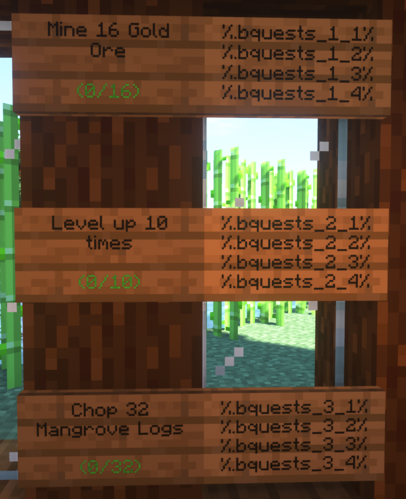
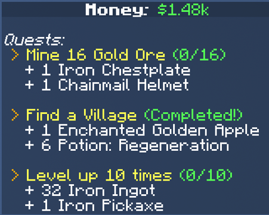
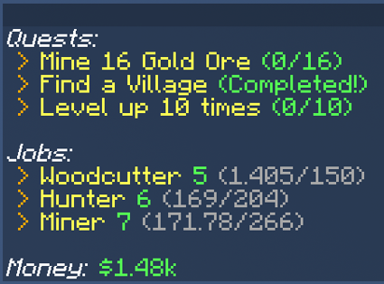

# BasicQuests
A plugin for Spigot servers that implements randomly generated basic quests with rewards for players.


## General
Author: Tonnanto  
Current Version: 0.6.1

A **<ins>spigot</ins>** compatible Server is required to run this plugin!

**Version 0.6 and above supports Minecraft 1.21 and newer.**  
For older Minecraft versions, please use [v0.5](https://github.com/Tonnanto/BasicQuests/releases/tag/v0.5).

Download the plugin and find the Project Page on [SpigotMC](https://www.spigotmc.org/resources/basicquests.87972/) and [Bukkit](https://dev.bukkit.org/projects/basicquests).


## How it works
Every player receives an initial number of quests (default: 3).
You can view your active quests by using `/quests list` or `/quests list rewards`.
When a player completes a quest, the reward can be received by clicking the reward button in the chat or by using `/quests reward`.
As soon as a quest's reward has been collected, the quest disappears from the list, and a newly generated quest will be added.  
By default, a player is allowed to skip one quest every 24h by using `/quests skip`.
Some quests require the player to complete an advancement before they can be generated. Quests in the nether, for example, require the player to have completed the ***"Diamonds!"*** advancement.  
Also, newly generated quests will increase in their quantities proportional to the players' playtime on the server: While a new player might receive a quest like ***"Mine 32 Iron Ore"*** a player with lots of playtime on the server would rather receive a quest like this ***"Mine 512 Iron Ore"***.
This feature can be precisely adjusted in the `config.yml` or be turned off entirely.  
Some quests are incredibly rare but promise very high rewards once completed. Each quest is assigned a number of stars (⭐) based on its difficulty. Collect stars by completing quests and compete with others on the leaderboard which can be viewed using `/quests leaderboard`.


## Quests
Quests are randomly generated in Basic Quests. 
Currently available quest types along with some examples are listed below:

* Mine Block
* Kill Entity
* Harvest Block
* Chop Wood
* Enchant Item
* Find Structure
* Trade with Villager
* Gain Level
* Reach Level
* Break Block
* Fish Item
* Increase Stat

Quest ideas I am thinking about implementing in the future:

* Breed Animal
* Tame Animal
* Smelt Item
* Brew Potion


## Rewards
Possible Rewards are either ***Items***, ***Money*** or ***XP***. You can enable or disable each of these reward types in the `config.yml`.
By default, only item-rewards are enabled. In order to use money-rewards you need to have an ***economy plugin*** connected via ***Vault***.
If multiple reward types are enabled one will be chosen at random when a new quest is generated - at least one reward type must be enabled or BasicQuests will not work.  
The value of a reward is proportional to the value of the quest and is multiplied by the `reward-factor` which can also be adjusted in the `config.yml`.
The value of a given quest is determined by a number of factors along its generation process.  
While money and xp-rewards are self-explanatory I'll list some examples for item-rewards below:

* Tools (Iron - Netherite) (Maybe enchanted)
* Armor (Chainmail - Netherite) (Maybe enchanted)
* Smithing Templates
* Enchanted Books
* Potions (Only positive effects - extended (+) and upgraded (II) variants)
* Food
* Resources (Most of the valuable things you can find underground - From Flint to Netherite)
* Rare Items (Enchanted Golden Apple, Music Disks, Saddle, ...)


## Quest Generation Customization
BasicQuest allows admins to fine-tune the quest generation on their servers using a bunch of yaml files in the `quest_generation` directory.  
This allows for:
- adjusting or removing the probability of quest types
- adjusting or removing the probability of specific quests within a quest type
- making certain quests more or less valuable. This will be reflected in the value of the reward.
- adjusting the amounts that appear in quests.

For further information about how to fine tune the generation process check out the readme file at `plugins/BasicQuests/quest_generation/README.md`


## Example Quests
You now know what type of Quests and Rewards are available.
Here are some examples of randomly generated Quests along with their Rewards.  
Remember that there are a lot of possibilities to tweak the Quest and Reward generation in the `config.yml` and in the `quest_generation` files.


---
#### Mine 144 Coal Ore (⭐⭐)
+ 184 XP

---
#### Harvest 32 Potatoes (⭐)
+ 4 Copper Ingot
+ 1 Iron Hoe

---
#### Chop 160 Logs (⭐⭐)
+ $ 228.00

---
#### Enchant a Diamond Axe (⭐)
+ 4 Book


---
#### Fish a treasure (⭐⭐)
+ 1 Iron Pickaxe: Efficiency IV

---
#### Find a Swamp Hut (⭐⭐⭐⭐⭐)
+ 36 Emerald
+ 1 Jukebox

---
#### Harvest 48 Wheat (⭐)
+ $ 96.00

---
#### Harvest 16 Potatoes (⭐)
+ 30 XP

---
#### Harvest 14 Chorus Flowers (⭐⭐⭐⭐⭐)
+ $ 4,608.00

---
#### Find an End City (⭐⭐⭐⭐⭐)
+ 1 Trident: Unbreaking I
+ 1 Enchanted Book: Infinity

---
#### Kill 10 Cows (⭐)
+ $ 120.00

---
#### Mine 48 Nether Quartz Ore (⭐⭐⭐)
+ 1 Iron Boots: Unbreaking III

---
#### Enchant a Diamond Sword with Knockback I+ (⭐⭐)
+ 4 Splash Potion: Regeneration +

---
#### Break 4 Amethyst Clusters (⭐⭐)
+ 1 Iron Sword: Looting I

---
#### Find an Ocean Monument (⭐⭐⭐⭐)
+ 10 Diamond

---
#### Drive 600m in a Minecart (⭐⭐⭐⭐)
+ 1 Netherite Sword: Sweeping III

---
#### Catch 20 fish (⭐⭐)
+ $ 352.00

---
#### Mine 4 Ancient Debris (⭐⭐⭐⭐)
+ 6 Sea Lantern
+ 48 Cooked Porkchop

---
#### Harvest 96 Carrots (⭐⭐)
+ 3 Splash Potion: Water Breathing

---
#### Ride 2km on a Horse (⭐⭐⭐⭐)
+ 1 Enchanted Book: Protection IV
+ 1 Enchanted Book: Sweeping III

---
#### Chop 64 Logs (⭐)
+ 1 Fishing Rod: Luck Of The Sea I

---
#### Play some Music (⭐⭐⭐⭐)
+ $ 3,000.00

---
#### Level up 40 times (⭐⭐⭐)
+ 1 Enchanted Book: Power V

---
#### Run 7,5km (⭐⭐⭐⭐)
+ 12 Amethyst Shard

---
#### Chop 160 Logs (⭐⭐)
+ $ 228.00

---
#### Trade with a Leatherworker 4 times (⭐⭐)
+ 8 Ender Pearl

---
#### Enchant a Diamond Boots with Swift Sneak I+ (⭐⭐⭐)
+ 921 XP

---
#### Find a Village (⭐⭐⭐)
+ $ 840.00

---
#### Harvest 40 Nether Warts (⭐⭐⭐)
+ 40 Quartz
+ 1 Diamond Axe

---
#### Harvest 80 Sugar Cane (⭐⭐)
+ $ 480.00

---
#### Harvest 112 Beetroots (⭐⭐)
+ 2 Diamond

---
#### Find an Ocean Monument (⭐⭐⭐⭐)
+ 1260 XP

---
#### Harvest 32 Sugar Cane (⭐)
+ 1 Iron Leggings
+ 1 Potion: Instant Health II
+ 1 Iron Sword

---
#### Trade with a Farmer 2 times (⭐⭐)
+ $ 320.00

---
#### Ring a Bell (⭐⭐⭐⭐)
+ 1200 XP

---
#### Enchant a Diamond Chestplate with Unbreaking I+ (⭐⭐⭐)
+ 614 XP

---
#### Find an Ocean Ruin (⭐⭐⭐)
+ 64 Arrow

---
#### Find a Desert Pyramid (⭐⭐⭐)
+ 1 Diamond Sword: Fire Aspect I

---
#### Trade with a Villager 8 times (⭐⭐)
+ 345 XP

---
#### Reach level 45 (⭐⭐)
+ 1 Enchanted Book: Unbreaking III

---
#### Kill 28 Endermen (⭐⭐⭐⭐⭐)
+ $ 5,628.00

---
#### Trade with a Mason 8 times (⭐⭐⭐)
+ 1 Diamond Axe
+ 6 Potion: Instant Health II

---
#### Find a Shipwreck (⭐⭐⭐)
+ $ 1,260.00

---
#### Trade with a Cleric 4 times (⭐⭐⭐)
+ $ 960.00

---
#### Mine 160 Coal Ore (⭐⭐)
+ 204 XP

---
#### Harvest 48 Brown Mushrooms (⭐⭐)
+ 32 Arrow

---
#### Reach level 45 (⭐⭐)
+ 247 XP

---
#### Enchant a Diamond Shovel with Fortune I+ (⭐⭐)
+ 230 XP

---
#### Level up 40 times (⭐⭐⭐)
+ 1 Enchanted Book: Respiration III
+ 1 Chainmail Chestplate: Projectile Protection II

---
#### Harvest 40 Red Mushrooms (⭐⭐)
+ 5 Emerald

---
#### Find a Desert Pyramid (⭐⭐⭐)
+ 756 XP

---
#### Enchant 6 Books (⭐⭐)
+ 1 Diamond Hoe

---
#### Trade with a Villager 12 times (⭐⭐⭐)
+ $ 832.00

---
#### Break 6 Amethyst Clusters (⭐⭐)
+ $ 640.00

---
#### Ride 11km on a Horse (⭐⭐⭐⭐⭐)
+ 1 Netherite Sword: Looting II
+ 1 Enchanted Book: Fire Protection IV

---
#### Travel 2km with a Boat (⭐⭐⭐)
+ 1 Iron Shovel: Efficiency IV
+ 1 Music Disc Pigstep

---
#### Chop 64 Logs (⭐)
+ 61 XP

---
#### Run 15km (⭐⭐⭐⭐⭐)
+ 12 Amethyst Shard
+ 1 Snout Armor Trim Smithing Template

---
#### Trade with a Cleric 6 times (⭐⭐⭐)
+ 1 Dune Armor Trim Smithing Template

---
#### Travel 1km with a Boat (⭐⭐)
+ 420 XP

---
#### Enchant a Crossbow with Piercing III+ (⭐⭐⭐)
+ 8 Blaze Rod

---
#### Harvest 48 Wheat (⭐)
+ 4 Copper Ingot
+ 1 Iron Pickaxe

---
#### Harvest 32 Bamboo (⭐⭐)
+ 24 Flint

---
#### Harvest 32 Sugar Cane (⭐)
+ 115 XP

---
#### Find a Village (⭐⭐⭐)
+ 504 XP

---
#### Harvest 32 Sugar Cane (⭐)
+ $ 192.00

---
#### Find a Nether Fortress (⭐⭐⭐⭐)
+ 1 Enchanted Book: Protection IV

---
#### Chop 160 Logs (⭐⭐)
+ 40 Coal


---
### The following quests were generated with a `quantity-factor` of 3.0 instead of 1.0
---


---
#### Drive 5,5km in a Minecart (⭐⭐⭐⭐⭐)
+ $ 5,250.00

---
#### Run 62,5km (⭐⭐⭐⭐⭐⭐⭐)
+ 11250 XP

---
#### Mine 9 Emerald Ore (⭐⭐⭐⭐⭐)
+ $ 4,704.00

---
#### Harvest 80 Nether Warts (⭐⭐⭐⭐)
+ $ 2,688.00

---
#### Chop 128 Logs (⭐)
+ $ 186.00

---
#### Harvest 96 Cocoa Beans (⭐⭐⭐)
+ 52 Golden Carrot

---
#### Kill 60 Endermen (⭐⭐⭐⭐⭐⭐)
+ 576 Arrow
+ 18 Splash Potion: Instant Health II

---
#### Mine 688 Coal Ore (⭐⭐⭐)
+ 837 XP

---
#### Mine 272 Iron Ore (⭐⭐⭐)
+ 664 XP

---
#### Harvest 336 Carrots (⭐⭐⭐)
+ 645 XP

---
#### Trade with a Fletcher 14 times (⭐⭐)
+ 3 Diamond

---
#### Kill 51 Magma Cubes (⭐⭐⭐⭐⭐⭐)
+ $ 10,560.00

---
#### Chop 288 Jungle Logs (⭐⭐⭐)
+ 548 XP

---
#### Enchant a Diamond Chestplate with Unbreaking I+ (⭐⭐⭐)
+ 614 XP

---
#### Harvest 24 Brown Mushrooms (⭐⭐)
+ 1 Diamond


## Placeholder
BasicQuests supports the following placeholders:

`%bquests%`				A (multiline) list of the players quests (same output as /quests list)  
`%bquests_detail%`			A (multiline) list of the players quests and rewards (same output as /quests list reward)  
`%bquests_count%` 			The amount of quests the player has  
`%bquests_completed%` 	The amount of quests the player has completed  
`%bquests_top_<index>%` The leaderboard of players with most completed quests (line by line)  
`%bquests_<index>%`			The players quest at the given index  
`%bquests_<index>_title%`	    The title of the players quest at the given index  
`%bquests_<index>_progress%`		The progress of the players quest at the given index: "1/16" or "Completed!"  
`%bquests_<index>_left%`			The amount left of the players quest at the given index: "15 left"  
`%bquests_<index>_<linenumber>%`		The title of a given quest split into 4 lines that fit on a sign. (linenumber can be 1 - 4, Check the example below)  
`%bquests_<index>_reward_<linenumber>%`	The reward of a given quest split into 2 lines. Handy for Scoreboards. (linenumber can be 1 - 2, Check the example below)  


## Placeholder Examples

### Signs
The [PlaceholderSIGN](https://www.spigotmc.org/resources/placeholdersign.74425/) plugin can be used to display quests on signs like so.
You can see which placeholders have been used on the right. (Leave away the dot after the first %)



### Scoreboards
Scoreboard plugins like [AnimatedScoreboard](https://www.spigotmc.org/resources/animatedscoreboard.20848/) can be used to display quests on a custom scoreboard.
Two examples along with the used placeholders are shown below.

####Quests with rewards:
```
Quests:
%bquests_1%
%bquests_1_reward_1%
%bquests_1_reward_2%

%bquests_2%
%bquests_2_reward_1%
%bquests_2_reward_2%

%bquests_3%
%bquests_3_reward_1%
%bquests_3_reward_2%
```


####Quests next to other plugins:
```
Quests:
%bquests_1%
%bquests_2%
%bquests_3%

Jobs:
...
```



## License
Copyright (C) 2020-2024, Anton Stamme

BasicQuests is free software: you can redistribute it and/or modify
it under the terms of the GNU General Public License as published by
the Free Software Foundation, either version 3 of the License, or
(at your option) any later version.

BasicQuests is distributed in the hope that it will be useful,
but WITHOUT ANY WARRANTY; without even the implied warranty of
MERCHANTABILITY or FITNESS FOR A PARTICULAR PURPOSE.  See the
GNU General Public License for more details.

You should have received a copy of the GNU General Public License
along with BasicQuests.  If not, see <https://www.gnu.org/licenses/>.
